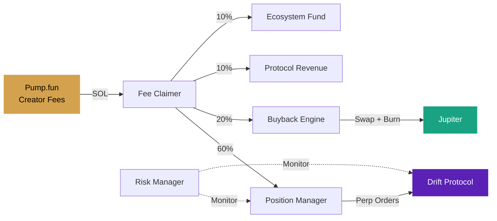

<h1 align="center">Fission Protocol</h1>

<p align="center">
  <strong>Perpetual-backed token derivatives on Solana</strong>
</p>

<p align="center">
  <a href="https://github.com/FissionDotFun/fission/actions/workflows/ci.yml"></a>
  <a href="https://github.com/FissionDotFun/fission/blob/main/LICENSE"></a>
  <a href="https://github.com/FissionDotFun/fission"></a>
  <a href="https://github.com/FissionDotFun/fission"></a>
  <a href="https://github.com/FissionDotFun/fission"></a>
</p>

<p align="center">
  <a href="https://fission.fun">Website</a> &nbsp;&middot;&nbsp;
  <a href="#how-it-works">How It Works</a> &nbsp;&middot;&nbsp;
  <a href="#architecture">Architecture</a> &nbsp;&middot;&nbsp;
  <a href="#getting-started">Getting Started</a> &nbsp;&middot;&nbsp;
  <a href="#api">API</a> &nbsp;&middot;&nbsp;
  <a href="CONTRIBUTING.md">Contributing</a>
</p>

<br />

## Overview

Fission is a protocol that transforms memecoin creator fees into automated perpetual positions. Creators launch tokens on Pump.fun with fees routed to the Fission engine, which autonomously opens perp positions on Drift, executes buybacks via Jupiter, and manages risk — all without vaults or deposits.

<br />

## How It Works

```
  Creator launches token          Fission verifies            Engine runs
  on Pump.fun with 100%           on-chain config             autonomously
  fees → Protocol wallet          and registers token         24/7
          |                              |                          |
          v                              v                          v
  +----------------+           +-------------------+       +-------------------+
  |   Pump.fun     |           |   Registration    |       |  Autonomous       |
  |                |---fees--->|                   |--ok-->|  Engine            |
  |  Fee Share     |           |  PDA Derivation   |       |                   |
  |  100% -> PWA   |           |  Admin Revoked?   |       |  Fee Claimer      |
  |  Admin = x     |           |  Allocation OK?   |       |  Position Mgr     |
  +----------------+           +-------------------+       |  Buyback Engine   |
                                                           |  Risk Manager     |
                                                           +-------------------+
```

### Three Steps

| Step | Action | Detail |
|:----:|--------|--------|
| **01** | **Launch on Pump.fun** | Deploy your token with 100% creator fee share allocated to the protocol wallet. Admin must be revoked. |
| **02** | **Register with Fission** | Submit your mint address. On-chain verification confirms fee configuration and admin revocation. |
| **03** | **Automated Engine** | Fees are claimed, split into perpetual positions (60%), buybacks (20%), and revenue (10%+10%). Fully autonomous. |

### Fee Distribution

```
                  +------ 60% ------> Drift Perp Positions
                  |
Creator Fees -----+------ 20% ------> Token Buyback + Burn
                  |
                  +------ 10% ------> Protocol Revenue
                  |
                  +------ 10% ------> Ecosystem Fund
```

<br />

## Architecture

```
fission/
├── index.html                    # Single-page application entry
├── vite.config.js                # Vite build configuration
│
├── src/
│   ├── main.js                   # App initialization and module orchestration
│   │
│   ├── js/
│   │   ├── dashboard.js          # Live dashboard — search, sort, modal detail view
│   │   ├── data.js               # Data layer, formatting utilities, API fallback
│   │   ├── launcher.js           # Multi-step token registration wizard
│   │   ├── particles.js          # Canvas particle network with mouse repulsion
│   │   ├── stats.js              # Animated counter system with IntersectionObserver
│   │   ├── ticker.js             # Real-time price ticker via CoinGecko
│   │   ├── toast.js              # Non-blocking notification system
│   │   └── typewriter.js         # Cycling tagline animation
│   │
│   └── styles/
│       ├── variables.css          # Design tokens — colors, spacing, typography
│       ├── reset.css              # Normalize and base element styles
│       ├── components.css         # Buttons, inputs, cards, modals, wizards
│       ├── layout.css             # Page sections, dashboard, responsive grid
│       ├── animations.css         # Keyframes, reveal transitions, micro-animations
│       └── effects.css            # Glass cards, decorative rules
│
├── backend/
│   ├── server.js                  # Express server — CORS, rate limiting, static serving
│   ├── config.js                  # Environment variable management
│   │
│   ├── api/
│   │   ├── routes.js              # RESTful route definitions
│   │   └── controllers.js         # Request validation, response formatting
│   │
│   ├── services/
│   │   ├── drift.js               # Drift Protocol SDK — perp order management
│   │   ├── jupiter.js             # Jupiter Aggregator — token swap execution
│   │   ├── pumpfun.js             # Pump.fun — fee sharing PDA verification
│   │   └── solana.js              # Solana RPC connection and wallet management
│   │
│   ├── workers/
│   │   ├── scheduler.js           # Worker lifecycle, health tracking, intervals
│   │   ├── fee-claimer.js         # Claims accumulated creator fees on-chain
│   │   ├── position-manager.js    # Opens and adjusts Drift perpetual positions
│   │   ├── buyback-engine.js      # Executes token buybacks via Jupiter + burn
│   │   └── risk-manager.js        # Monitors exposure, drawdowns, liquidation risk
│   │
│   ├── db/
│   │   └── firebase.js            # Firestore persistence with in-memory mock fallback
│   │
│   └── utils/
│       ├── logger.js              # Structured logging with levels and context
│       └── helpers.js             # Shared utility functions
│
├── .github/
│   ├── workflows/ci.yml           # CI — build + health check on Node 18/20
│   ├── ISSUE_TEMPLATE/            # Bug report and feature request templates
│   └── PULL_REQUEST_TEMPLATE.md   # PR checklist
│
├── CONTRIBUTING.md                # Development setup and code style guide
├── SECURITY.md                    # Vulnerability reporting policy
└── LICENSE                        # MIT
```

### System Flow



<br />

## Tech Stack

| Layer | Technology | Purpose |
|-------|------------|---------|
| **Frontend** | Vite, Vanilla JS, CSS Custom Properties | Landing page, dashboard, launch wizard |
| **Backend** | Node.js, Express | REST API, worker orchestration |
| **Perpetuals** | Drift Protocol SDK | Opening and managing perp positions |
| **Swaps** | Jupiter Aggregator | Token buybacks and burns |
| **Database** | Firebase Firestore | Persistent state (mock fallback for dev) |
| **Blockchain** | Solana | Settlement and on-chain verification |
| **Prices** | CoinGecko API | Real-time ticker data |

<br />

## Getting Started

### Prerequisites

- Node.js 18+
- npm 9+

### Frontend

```bash
npm install
npm run dev
# → http://localhost:5173
```

### Backend

```bash
cd backend
npm install
cp .env.example .env
npm start
# → http://localhost:3001
```

> **Note:** The backend runs in **mock mode** when `FIREBASE_SERVICE_ACCOUNT` is not set. All API endpoints work with an in-memory store — no external dependencies needed for development.

### Environment Variables

| Variable | Description | Default |
|----------|-------------|---------|
| `PORT` | Backend server port | `3001` |
| `SOLANA_RPC_URL` | Solana RPC endpoint | Public mainnet |
| `PROTOCOL_WALLET` | Protocol fee recipient | Built-in |
| `FIREBASE_SERVICE_ACCOUNT` | Path to Firebase credentials | Mock mode |
| `PROTOCOL_PRIVATE_KEY` | Base58 signing key | Required for production |

<br />

## API

All endpoints are prefixed with `/api/v1`. Responses are JSON.

### Tokens

| Method | Endpoint | Description |
|--------|----------|-------------|
| `GET` | `/tokens` | List all registered derivatives |
| `GET` | `/tokens/:mint` | Get token by mint address |
| `POST` | `/tokens/register` | Register new derivative (on-chain verification) |

### Positions & Buybacks

| Method | Endpoint | Description |
|--------|----------|-------------|
| `GET` | `/positions` | List all open perp positions |
| `GET` | `/positions/:mint` | Get position for a specific token |
| `GET` | `/buybacks` | List all executed buybacks |
| `GET` | `/buybacks/:mint` | Get buybacks for a specific token |

### System

| Method | Endpoint | Description |
|--------|----------|-------------|
| `GET` | `/health` | Server health and uptime |
| `GET` | `/stats` | Protocol-wide aggregate statistics |
| `GET` | `/status` | Full engine status with worker health |
| `GET` | `/runs` | List all worker execution runs |

### Example

```bash
# Register a new derivative
curl -X POST http://localhost:3001/api/v1/tokens/register \
  -H "Content-Type: application/json" \
  -d '{"mint": "So11111111111111111111111111111111111111112", "underlying": "SOL"}'

# Check engine status
curl http://localhost:3001/api/v1/status
```

<br />

## Workers

The engine runs four autonomous workers in staggered intervals. Each worker independently handles its domain and reports health to the scheduler.

| Worker | Interval | Responsibility |
|--------|----------|----------------|
| **Fee Claimer** | 60 min | Claims accumulated creator fees from all registered tokens |
| **Position Manager** | 75 min | Opens or adjusts Drift perpetual positions based on claimed fees |
| **Buyback Engine** | 90 min | Swaps allocated SOL for derivative tokens via Jupiter and burns |
| **Risk Manager** | 100 min | Monitors position exposure, drawdowns, and liquidation proximity |

```
Timeline (one cycle):

0m     Fee Claimer starts
       ├── Iterate registered tokens
       ├── Claim fees from Pump.fun
       └── Record to Firestore

60m    Position Manager starts
       ├── Read unclaimed fee pool
       ├── Calculate position sizing
       └── Submit orders to Drift

75m    Buyback Engine starts
       ├── Allocate buyback budget
       ├── Execute Jupiter swaps
       └── Burn acquired tokens

90m    Risk Manager starts
       ├── Check position health
       ├── Evaluate drawdown thresholds
       └── Flag or close risky positions
```

<br />

## Contributing

See [CONTRIBUTING.md](CONTRIBUTING.md) for development setup and guidelines.

## Security

See [SECURITY.md](SECURITY.md) for vulnerability reporting.

## License

MIT — see [LICENSE](LICENSE) for details.
