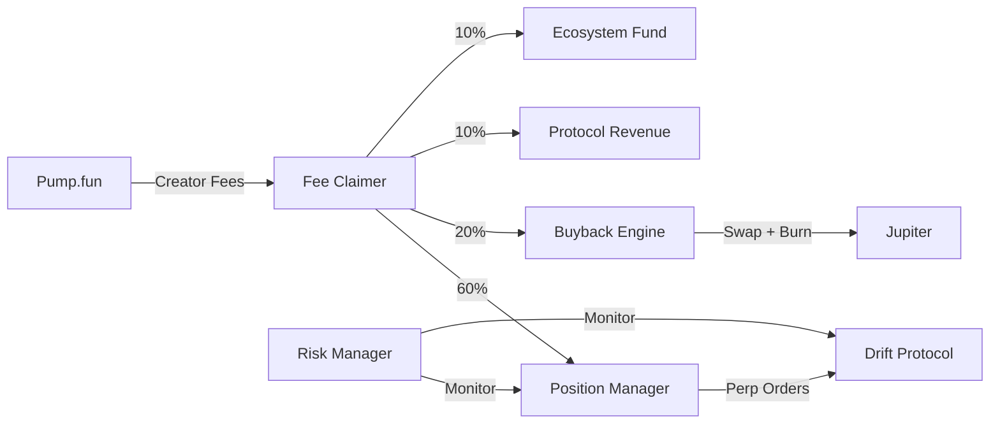

<h1 align="center">Fission Protocol</h1>

<p align="center">
  <strong>Perpetual-backed token derivatives on Solana</strong>
</p>

<p align="center">
  <a href="https://fission.fun">Website</a> &nbsp;&middot;&nbsp;
  <a href="#how-it-works">How It Works</a> &nbsp;&middot;&nbsp;
  <a href="#architecture">Architecture</a> &nbsp;&middot;&nbsp;
  <a href="#getting-started">Getting Started</a>
</p>

<br />

## Overview

Fission is a protocol that transforms memecoin creator fees into automated perpetual positions. Creators launch tokens on Pump.fun with fees routed to the Fission engine, which autonomously opens perp positions on Drift, executes buybacks via Jupiter, and manages risk — all without vaults or deposits.

<br />

## How It Works

```
  Creator launches token          Fission verifies            Engine runs
  on Pump.fun with 100%           on-chain config             autonomously
  fees → Protocol wallet          and registers token         24/7
          │                              │                          │
          ▼                              ▼                          ▼
  ┌──────────────┐            ┌──────────────────┐        ┌─────────────────┐
  │   Pump.fun   │            │   Registration   │        │  Autonomous     │
  │              │───fees────▶│                  │───ok──▶│  Engine         │
  │  Fee Share   │            │  PDA Derivation  │        │                 │
  │  100% → PWA  │            │  Admin Revoked?  │        │  Fee Claimer    │
  │  Admin = ✗   │            │  Allocation OK?  │        │  Position Mgr   │
  └──────────────┘            └──────────────────┘        │  Buyback Engine │
                                                          │  Risk Manager   │
                                                          └─────────────────┘
```

### Three Steps

| Step | Action | Detail |
|------|--------|--------|
| **01** | Launch on Pump.fun | Deploy your token with 100% creator fee share allocated to the protocol wallet. Admin must be revoked. |
| **02** | Register with Fission | Submit your mint address. We verify on-chain that fee configuration and admin revocation are correct. |
| **03** | Automated Engine | Fees are claimed, split into perpetual positions (60%), buybacks (20%), and revenue (10%+10%). Fully autonomous. |

<br />

## Architecture

```
fission/
├── index.html                    # Single-page application entry
├── src/
│   ├── main.js                   # App initialization
│   ├── js/
│   │   ├── dashboard.js          # Live dashboard with search/sort/modal
│   │   ├── data.js               # Data layer and formatting utilities
│   │   ├── launcher.js           # Token registration wizard
│   │   ├── particles.js          # Canvas particle network effect
│   │   ├── stats.js              # Animated protocol stats counters
│   │   ├── ticker.js             # Live price ticker (CoinGecko)
│   │   ├── toast.js              # Notification system
│   │   └── typewriter.js         # Hero tagline animation
│   └── styles/
│       ├── variables.css          # Design tokens and color system
│       ├── reset.css              # Normalize and base styles
│       ├── components.css         # Reusable component styles
│       ├── layout.css             # Page layout and sections
│       ├── animations.css         # Keyframes and transitions
│       └── effects.css            # Visual effects (cards, rules)
│
└── backend/
    ├── server.js                  # Express server with CORS and rate limiting
    ├── config.js                  # Environment configuration
    ├── api/
    │   ├── routes.js              # REST API route definitions
    │   └── controllers.js         # Request handlers
    ├── services/
    │   ├── drift.js               # Drift Protocol SDK integration
    │   ├── jupiter.js             # Jupiter Aggregator for swaps
    │   ├── pumpfun.js             # Pump.fun fee sharing verification
    │   └── solana.js              # Solana RPC connection management
    ├── workers/
    │   ├── scheduler.js           # Worker lifecycle and health tracking
    │   ├── fee-claimer.js         # Claims accumulated creator fees
    │   ├── position-manager.js    # Opens/adjusts Drift perp positions
    │   ├── buyback-engine.js      # Executes token buybacks via Jupiter
    │   └── risk-manager.js        # Monitors exposure and drawdowns
    ├── db/
    │   └── firebase.js            # Firestore with in-memory mock fallback
    └── utils/
        ├── logger.js              # Structured logging
        └── helpers.js             # Shared utility functions
```

### System Flow



<br />

## Tech Stack

| Layer | Technology |
|-------|------------|
| Frontend | Vanilla JS, Vite, CSS Custom Properties |
| Backend | Node.js, Express |
| Perpetuals | Drift Protocol SDK |
| Swaps | Jupiter Aggregator |
| Database | Firebase Firestore |
| Blockchain | Solana |
| Prices | CoinGecko API |

<br />

## Getting Started

### Prerequisites

- Node.js 18+
- npm 9+

### Frontend

```bash
npm install
npm run dev
# → http://localhost:5173
```

### Backend

```bash
cd backend
npm install
cp .env.example .env    # Edit with your configuration
npm start
# → http://localhost:3001
```

### Environment Variables

| Variable | Description | Required |
|----------|-------------|----------|
| `PORT` | Backend server port | No (default: 3001) |
| `SOLANA_RPC_URL` | Solana RPC endpoint | No (default: public mainnet) |
| `PROTOCOL_WALLET` | Protocol fee recipient wallet | No (default: built-in) |
| `FIREBASE_SERVICE_ACCOUNT` | Path to Firebase credentials JSON | No (mock mode if omitted) |
| `PROTOCOL_PRIVATE_KEY` | Base58 private key for signing | Yes (for production) |

> **Note:** The backend runs in mock mode when `FIREBASE_SERVICE_ACCOUNT` is not set. All API endpoints work with an in-memory store — no external dependencies needed for development.

<br />

## API

All endpoints are prefixed with `/api/v1`.

| Method | Endpoint | Description |
|--------|----------|-------------|
| `GET` | `/health` | Server health and uptime |
| `GET` | `/tokens` | List all registered derivatives |
| `GET` | `/tokens/:mint` | Get a specific token by mint address |
| `POST` | `/tokens/register` | Register a new derivative (on-chain verification) |
| `GET` | `/positions` | List all open perp positions |
| `GET` | `/stats` | Protocol-wide statistics |
| `GET` | `/status` | Full engine status with worker health |
| `GET` | `/buybacks` | List all executed buybacks |
| `GET` | `/runs` | List all worker execution runs |

<br />

## Workers

The engine runs four autonomous workers in staggered intervals:

| Worker | Interval | Function |
|--------|----------|----------|
| **Fee Claimer** | 60 min | Claims accumulated creator fees from registered tokens |
| **Position Manager** | 75 min | Opens or adjusts Drift perpetual positions based on claimed fees |
| **Buyback Engine** | 90 min | Swaps allocated SOL for derivative tokens and burns them |
| **Risk Manager** | 100 min | Monitors position exposure, drawdowns, and liquidation risk |

<br />

## License

MIT — see [LICENSE](LICENSE) for details.
